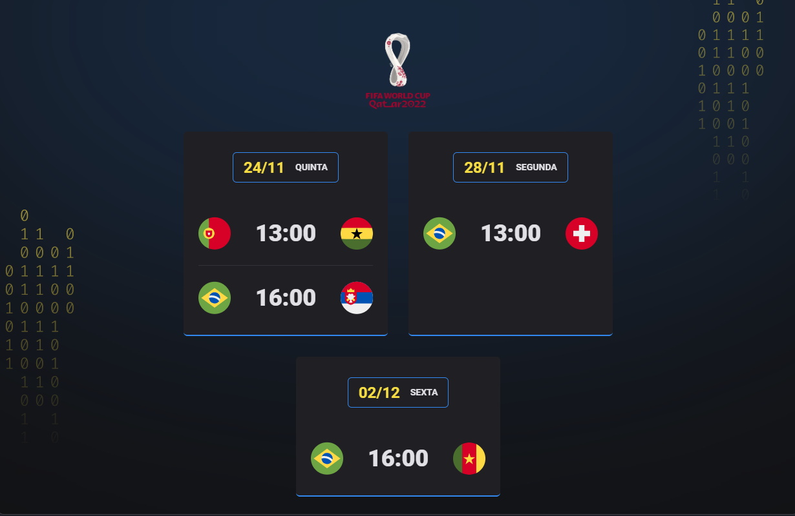

<h1 align="center"> Calendário da Copa - NLW Rocketseat </h1>

Evento exclusivo e gratuito, promovido pela Rocketseat para ensino de tecnologias WEB. A trilha escolhida foi a Explorer, para iniciantes em programação, onde aprendi os conceitos e técnicas báscias de HTLM, CSS e JavaScript.

  <a href="#-tecnologias">Tecnologias</a>&nbsp;&nbsp;&nbsp;|&nbsp;&nbsp;&nbsp;
  <a href="#-projeto">Projeto</a>&nbsp;&nbsp;&nbsp;|&nbsp;&nbsp;&nbsp;
  <a href="#-layout">Layout</a>&nbsp;&nbsp;&nbsp;|&nbsp;&nbsp;&nbsp;
  <a href="#memo-licença">Licença</a>

  

 

  

## 🚀 Tecnologias

Esse projeto foi desenvolvido com as seguintes tecnologias:

- HTML e CSS
- JavaScript
- Git e Github

## 💻 Projeto

O Calendário da Cop (NLW) é um projeto criado pela Rocketseat para ensinar, na prática, os principais conceitos e funcionalidades das tecnologias citadas acima. O objetivo da aplicação é desenvolver um ambiente com todas as datas dos jogos da Copa do Mundo de 2022.

## 🔖 Layout

Você pode visualizar o layout do projeto através [DESSE LINK](<https://www.figma.com/file/vdZS1dhtb0vlgE7K79NPnY/Calend%C3%A1rio-de-Jogos-(Community)?node-id=0%3A1>). É necessário ter conta no [Figma](https://figma.com) para acessá-lo.

## :memo: Licença

Esse projeto está sob a licença MIT.

---

Feito com ♥ by Rocketseat :wave: [Participe da nossa comunidade!](https://discord.gg/rocketseat)
